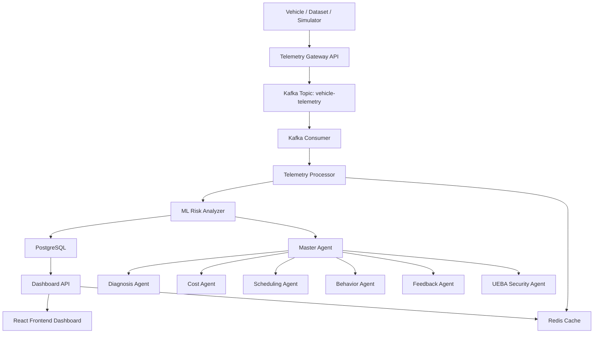
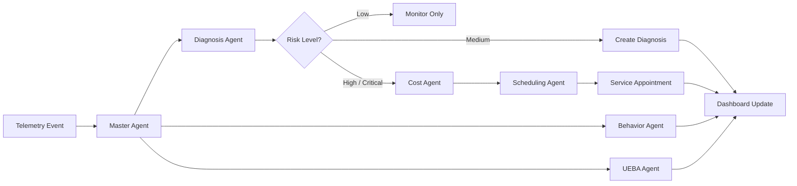
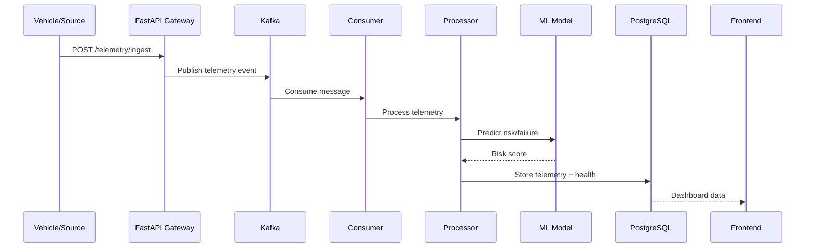
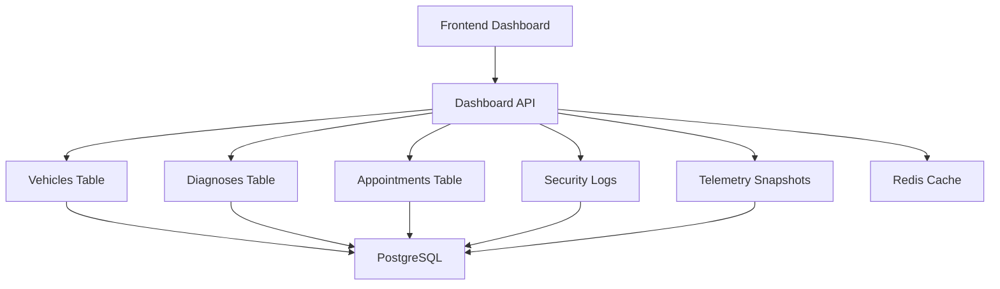
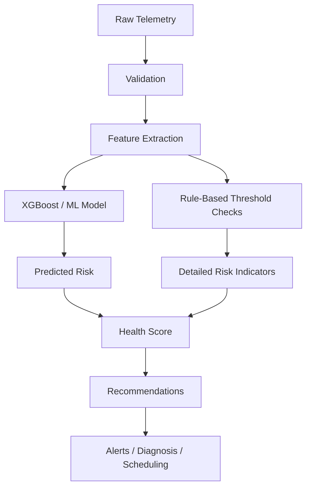
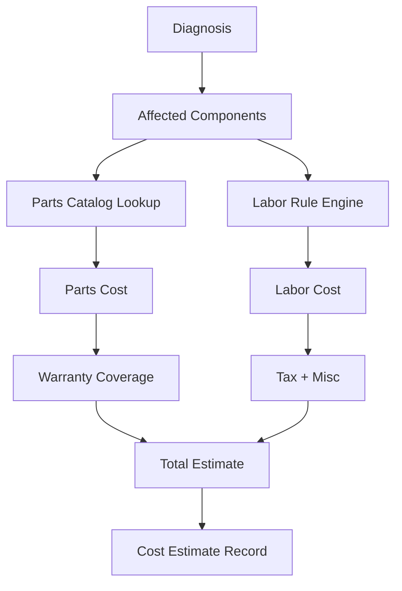
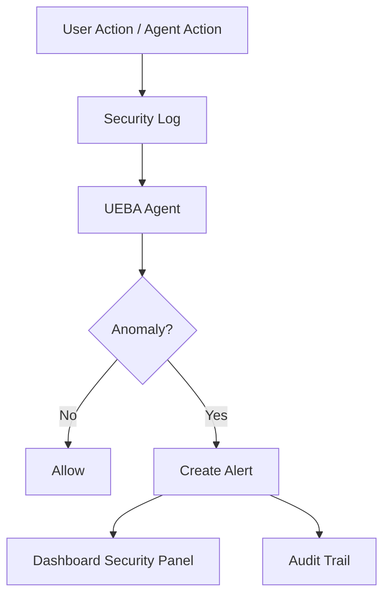
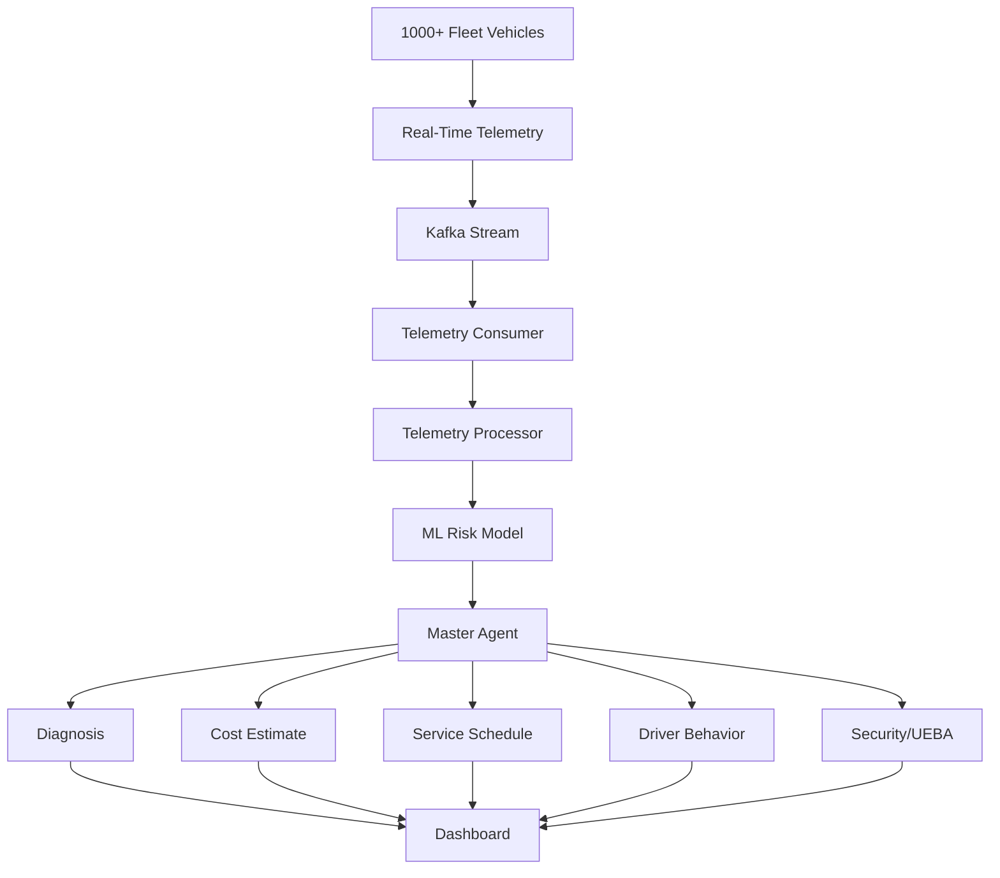

# Predictive Maintenance AI System

An enterprise-style **AI-powered predictive maintenance platform** for connected vehicles/fleets.  
It ingests telemetry, evaluates health in real time, predicts failures, estimates cost, auto-schedules service, analyzes driver behavior, and monitors security events.

---

## Table of Contents

- [Overview](#overview)
- [Key Features](#key-features)
- [System Architecture](#system-architecture)
- [Architecture Diagrams](#architecture-diagrams)
- [Data Flow](#data-flow)
- [AI/ML Flow](#aiml-flow)
- [Tech Stack](#tech-stack)
- [Project Structure](#project-structure)
- [Backend Modules](#backend-modules)
- [Frontend Modules](#frontend-modules)
- [How It Works](#how-it-works)
- [Database Design](#database-design)
- [Kafka / Redis / PostgreSQL Flow](#kafka--redis--postgresql-flow)
- [Authentication](#authentication)
- [Machine Learning Model](#machine-learning-model)
- [LangChain Agent Orchestration](#langchain-agent-orchestration)
- [Setup Instructions](#setup-instructions)
- [Run Locally](#run-locally)
- [Docker Infrastructure](#docker-infrastructure)
- [API Overview](#api-overview)
- [Real-Time Data Modes](#real-time-data-modes)
- [Screens / Demo Flow](#screens--demo-flow)
- [Future Enterprise Enhancements](#future-enterprise-enhancements)
- [License](#license)

---

## Overview

This project is a **fleet-scale predictive maintenance platform** that combines:

- **real-time vehicle telemetry**
- **machine learning failure prediction**
- **agentic orchestration**
- **cost estimation**
- **automatic appointment scheduling**
- **driver behavior intelligence**
- **security monitoring (UEBA)**

It supports both:
1. **historical seeded fleet data**
2. **real-time telemetry streaming** via API / simulator / dataset replay

---

## Key Features

- Real-time telemetry ingestion
- Predictive failure scoring with ML
- Diagnosis generation
- AI-based workflow orchestration
- Auto cost estimation
- Auto scheduling
- Driver behavior analytics
- RCA / CAPA feedback loop
- Kafka-based event stream
- Redis caching
- PostgreSQL persistence
- Clerk-based authentication
- Dashboard for fleet/OEM monitoring

---

## System Architecture

The platform is built around a **layered event-driven architecture**:

1. **Telemetry comes in**
2. **Gateway/API receives it**
3. **Kafka buffers it**
4. **Telemetry processor reads it**
5. **ML model assigns risk**
6. **Master Agent decides what to do**
7. **Workers do diagnosis, cost, scheduling, behavior**
8. **Frontend shows the result**

---

## Architecture Diagrams

### 1. High-Level System Architecture

### 2. Agentic Workflow Architecture

### 3. Event-Driven Pipeline

### 4. Dashboard Data Flow

### 5. Telemetry Risk Analysis Flow

### 6. Cost Estimation Flow

### 7. Security / UEBA Monitoring Flow

### 8. Full Fleet Operational Flow
